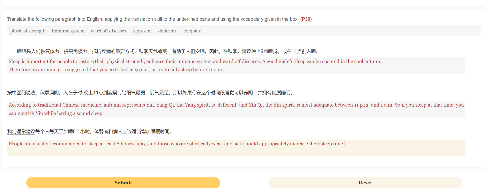
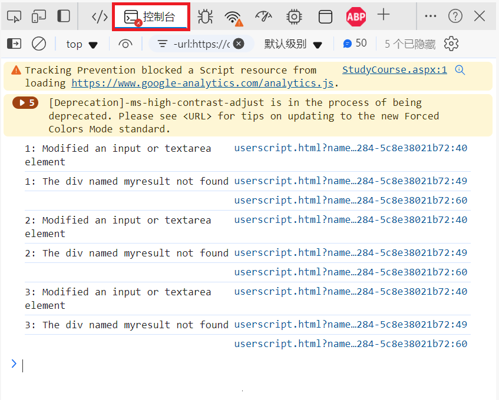
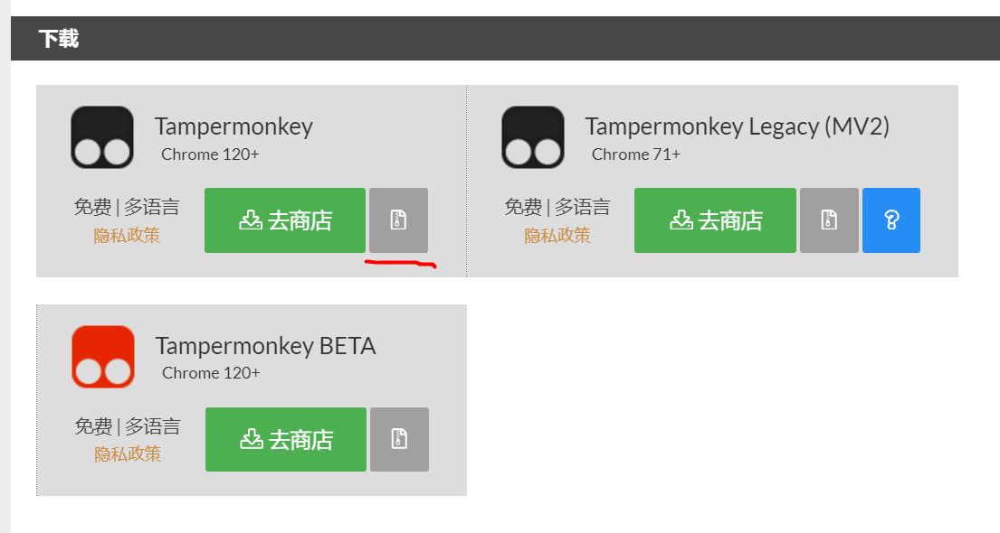
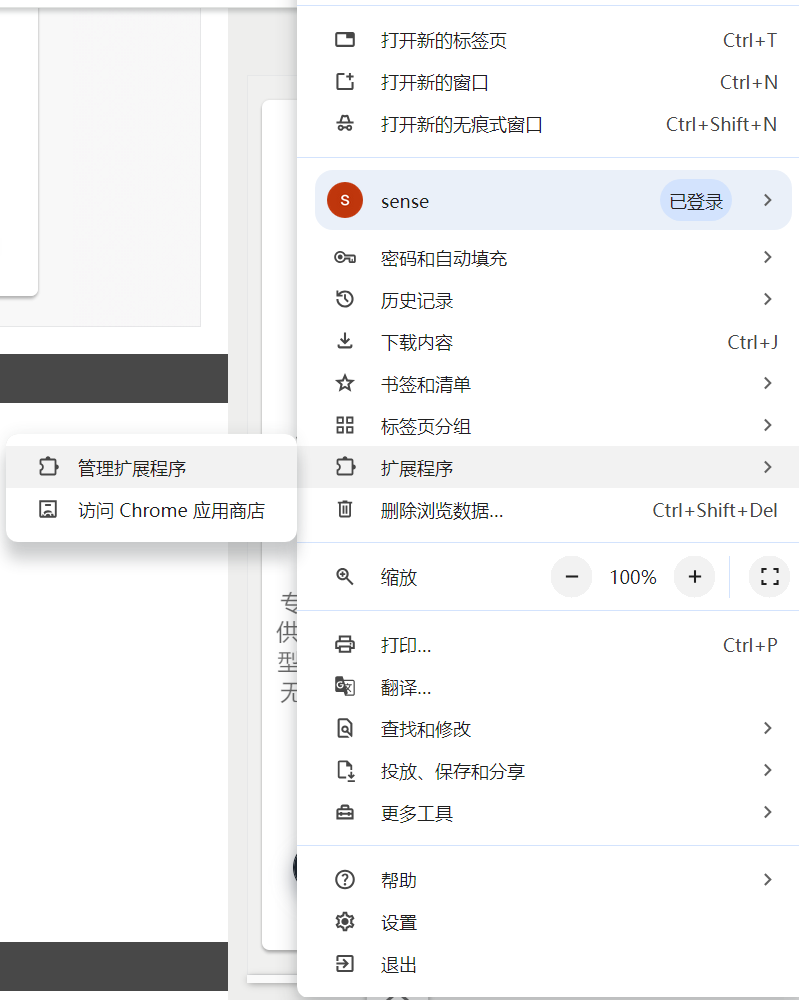
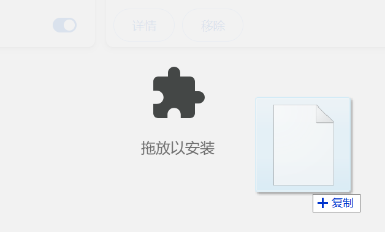
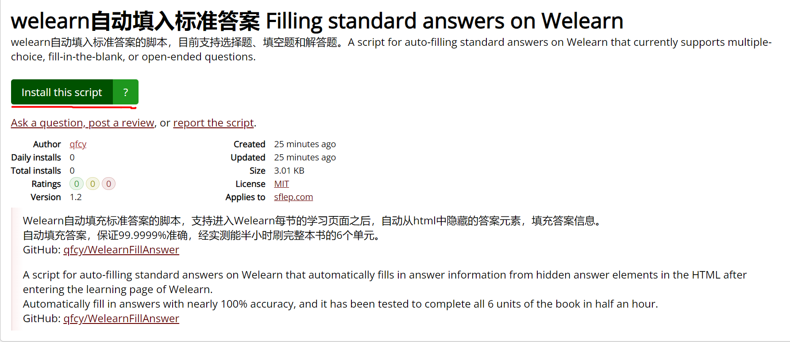
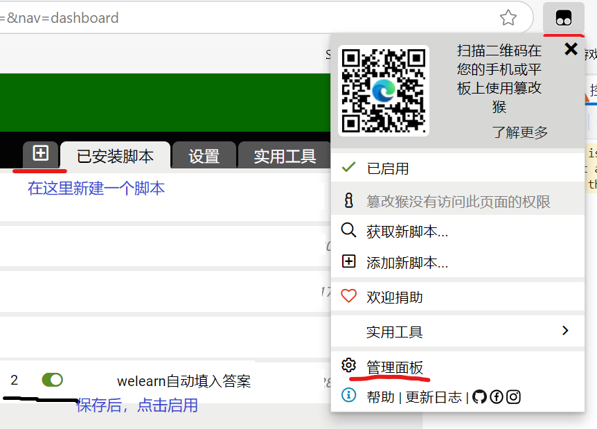

## WeLearn自动填充答案脚本

WeLearn自动填充标准答案的脚本，支持进入Welearn每节的学习页面之后，自动从html中隐藏的答案元素，填充答案信息。  
自动填充答案，保证99.9999%准确，经实测能半小时刷完整本书的6个单元。  

### 使用教程

##### 1.浏览器开发工具

首先进入WeLearn每节的学习页面，按下F12，打开浏览器的开发工具。  
再切换到控制台，粘贴脚本并回车，即可成功填入答案。  
注意如果浏览器显示“允许粘贴”导致粘贴失败，手输“允许粘贴”四个字再回车即可。  

##### 2.油猴脚本

**1.安装油猴浏览器插件**
如果是Edge，直接在[篡改猴 - Edge 加载项](https://microsoftedge.microsoft.com/addons/detail/%E7%AF%A1%E6%94%B9%E7%8C%B4/iikmkjmpaadaobahmlepeloendndfphd)点击“获取”，安装这个扩展即可。  

如果是Chrome并且不能用Chrome商店，首先打开[tampermonkey.net](https://www.tampermonkey.net/index.php)，再点击下载右侧的灰色按钮 (注意Chrome有时会拦截下载，允许即可)：

点击Chrome右上角的`...`按钮，打开扩展页面：

把下载的文件拖入，就能安装油猴插件:

**2.安装脚本**

安装脚本有GreasyFork和手动安装两种方法。  

**2.1.GreasyFork**

点击[welearn自动填入标准答案](https://greasyfork.org/en/scripts/528497-welearn%E8%87%AA%E5%8A%A8%E5%A1%AB%E5%85%A5%E6%A0%87%E5%87%86%E7%AD%94%E6%A1%88-filling-standard-answers-on-welearn)，再点击"install"，即可。  

**2.2.手动新建脚本**

打开油猴插件的管理面板，新建一个脚本，将已有的内容全部清空，从[welearn-greasyfork.js](welearn-greasyfork.js)复制全部代码，粘贴即可。  
保存后回到管理面板页面，打开左侧的“启用”开关。  

**3.运行脚本**
最后打开WeLearn的学习页面，如果打开WeLearn之后，油猴插件的图标变成“”，并且控制台出现了**userscript.html**的消息：

则脚本运行成功。  

### 用户反馈

在本仓库的[issue](https://github.com/qfcy/WelearnFillAnswer/issues)页面，新建一个issue并提交，即可。  